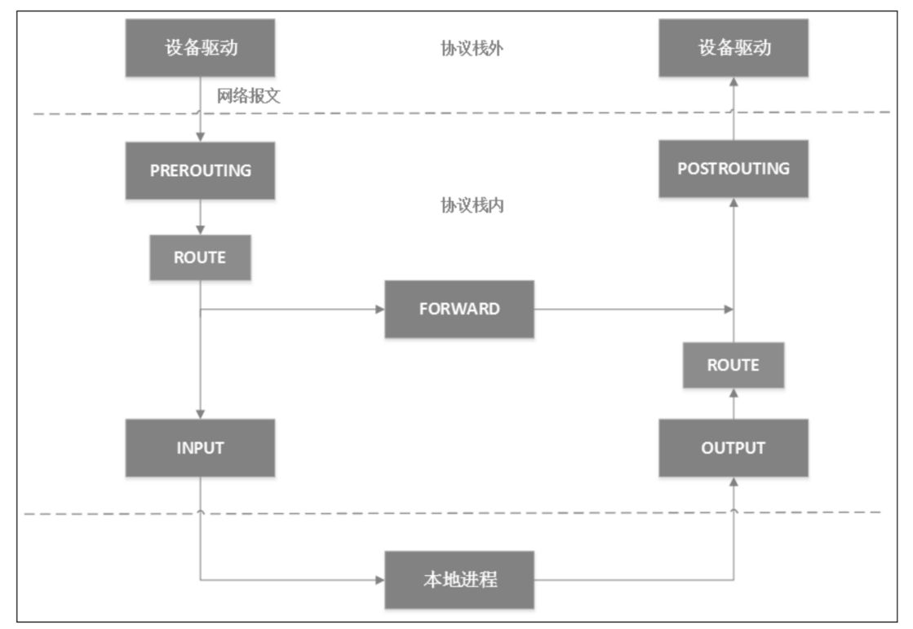
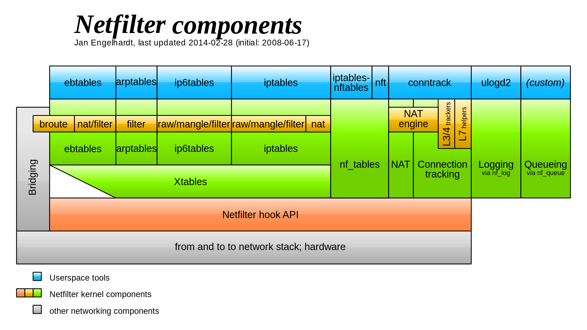
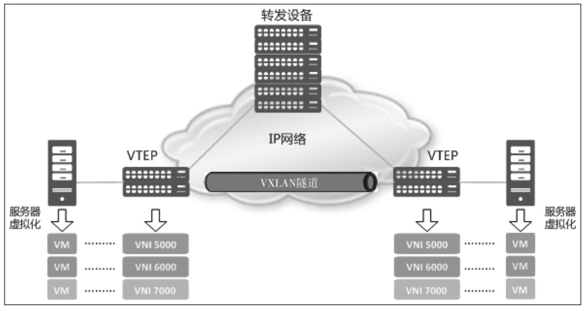

# 容器网络 (虚拟网络) 基础

> * 因为笔者对 计算机网络 认识浅薄, 加上很多的部分都是现学现卖，所以下述内容可能存在与具体事实相悖的内容, 所以如果发现请劳烦指正或讨论! 不胜感激.
>
> * 下文中如下词汇表达同一个意思： 数据帧，数据包

[TOC]

网络虚拟化是 虚拟化技术的子集。在 计算资源 和 存储资源 虚拟化的同时，也希望多台机器上的网络在逻辑上能够变成简单的网络结构，并且提供若干的管理能力。

当笔者第一次看到 Flannel (常用的 Kubernetes 组网组件) 的结构图的时候, 是懵的...WTF..... 为什么网络能弄得这么复杂...


这又是 网桥(bridge), 又是 veth pair , 还有什么逻辑 以太网设备 (`physical eth dev`), 和什么 VXLAN? WTH? 怎么感觉和 大学教的计算机网络课程一点关系都没有....老师只讲过 TCP/IP , OSI 七层网络....

## 容器网络 解决 什么问题, 为什么会有这些问题? 

但每一个技术方案的出现, 都是为了解决一个或多个问题, 容器网络要解决的问题(或需求)包括如下: 

* 每个 Pod 都有独立的 IP
* 不同 Pod 的容器间能互相通信 (即便是跨节点)

但这种问题其实不是只有容器网络遇到, 早在 `虚拟机时代` (VM), `OpenStack` 就已经遇到过这些问题, 可以通过 OpenStack 官网给出的计算节点结构略窥一二, 


可以看到这些虚拟网络设备, 在 OpenStack 节点的结构图上都有, 所以事实上, 其实所谓容器网络的方案解决的问题并不局限于容器网络, 或者虚拟机网络, 本质是为了解决 `不同场景下的网络虚拟化需求`.

`虚拟网络` 是相对于 `传统网络` 所提出的概念, 例如大型机房中, 需要有很多的 交换机/网线/网卡 等的 实体网络设备, 来让机房中的各个 Server 之间互相通信. 当 `虚拟化技术(VM/Container)` 开始升温之后, 一台16C64G 的实体机器上, 可能存在 十几个到上百个的 虚拟机, 他们宛如 大型机房中的多个主机, 之间需要解决互联的需求. 于是 便有了虚拟网络的概念. 但在当前的常见技术中, 尚无能完美解决这个需求的技术方案, 各家都在提出自己的方案, 用不同的技术, 来不断的优化. 例如 `OpenStack(一个 基于 KVM 的 虚拟机编排系统)` 本身对于 其虚拟化网络实现就进行了多次迭代, 容器网络生态中, 也针对 K8s 的 CNI 接口, 以 CNI-Plugin 的形式 , 提出了 各种实现方案, 例如

* Flannel
* Calico
* Weave
* Cilium
* CNI-Genie
* terway(Aliyun)

这里先简单聊一下CNI , CNI 全称 (Container Network Interface), 是 K8s 对外抽象的三个接口之一, 


CNI 的Interface 很简单, CNI-Plugin 只要实现下述接口, 再进行简单的配置, 就可以和 K8s 进行交互

```go
// Kubernetes CNI in version 1.20

type CNI interface {
	AddNetworkList(ctx context.Context, net *NetworkConfigList, rt *RuntimeConf) (types.Result, error)
	CheckNetworkList(ctx context.Context, net *NetworkConfigList, rt *RuntimeConf) error
	DelNetworkList(ctx context.Context, net *NetworkConfigList, rt *RuntimeConf) error
	GetNetworkListCachedResult(net *NetworkConfigList, rt *RuntimeConf) (types.Result, error)
	GetNetworkListCachedConfig(net *NetworkConfigList, rt *RuntimeConf) ([]byte, *RuntimeConf, error)

	AddNetwork(ctx context.Context, net *NetworkConfig, rt *RuntimeConf) (types.Result, error)
	CheckNetwork(ctx context.Context, net *NetworkConfig, rt *RuntimeConf) error
	DelNetwork(ctx context.Context, net *NetworkConfig, rt *RuntimeConf) error
	GetNetworkCachedResult(net *NetworkConfig, rt *RuntimeConf) (types.Result, error)
	GetNetworkCachedConfig(net *NetworkConfig, rt *RuntimeConf) ([]byte, *RuntimeConf, error)

	ValidateNetworkList(ctx context.Context, net *NetworkConfigList) ([]string, error)
	ValidateNetwork(ctx context.Context, net *NetworkConfig) ([]string, error)
}
```

这些方案通过不同的 Linux 能力和组件, 都实现了 可用的容器网络方案, 但在此之前, 先了解 这些 Linux 能力与组件.

## Linux 网络

### Linux 网络结构

一个网络数据帧从网线到 程序的用户内存空间中大概有如下步骤

1. 网卡读到数据包，解开 OSI L1 的封装后给到 Kernel

   

2. Kernel 会开始解包 OSI L2 层的封装，并且会在代码层面去调用例如 `bridge` || `macvlan` || `open vSwitch` 等 的 Handler，

   * 能够在二层接触到流量的模块，基本都是硬编码到内核的模块，当数据包从网卡到达的时候，直接就会调用相关的代码进行处理，例如 TAP 设备

3. Kernel 会开始解包 OSI L3 层的封装，并且会在代码层面去调用更多的三层规则，例如 netfilter

   * 三层上转发很大一部分都是依靠 netfilter，例如 `IPVS` / `iptables`，不过也有例外，例如 TUN 设备就应该是硬编码在内核的模块，还有 VXLAN 和 VLAN 都是在 Kernel 中独立的模块

4. Kernel 会开始解包 OSI L4 层的封装，并调用相关的方法

5. Kernel 会将 数据包 放到 socket 的 buffer 里，接着用户程序就可以通过 socket 连接读到。

由于笔者对于这块不是太熟，没有办法描述太多的东西在此，所以这里贴一张 内核调用分析的图 以及一张 Linux Kernel 模块图，劳烦读者自行理解


### OSI 七层结构

这里最关键的是 理解 2/3/4 层 以及 7 层分别在 网络传输的过程中分别在做什么事。


## 用于构建虚拟网络的工具

### 虚拟网卡 和  物理网卡 

虚拟网卡和物理网卡, 虽然中文里都叫网卡, 但是事实上他们是两种完全不一样的存在, 虚拟网卡的英文是 VNIC (virtual Network Interface Controller),  英文的直译应该是 `虚拟网络接口`, 而 VNIC 可以是多种 虚拟网络设备, 例如  Veth pair,回环地址,等, 它是一个虚拟的网络接口, 虚拟网卡和物理网卡不是一一对应的关系, 虚拟网卡甚至可以在没有物理网卡的情况下运行. 每个 虚拟网卡有自己的 PCI 地址 和 MAC 地址,  不一定有 IP 地址, 因为 IP 工作在 OSI 的第三层, 而 虚拟网卡工作在 OSI 的 第二层.


通过 `ip addr show` 命令, 可以列出主机上所有的 虚拟网卡 和 网桥 的信息. 

```shell
1: lo: <LOOPBACK,UP,LOWER_UP> mtu 65536 qdisc noqueue state UNKNOWN group default qlen 1000
    link/loopback 00:00:00:00:00:00 brd 00:00:00:00:00:00
    inet 127.0.0.1/8 scope host lo
       valid_lft forever preferred_lft forever
    inet6 ::1/128 scope host 
       valid_lft forever preferred_lft forever
2: enp2s0: <BROADCAST,MULTICAST,UP,LOWER_UP> mtu 1500 qdisc fq_codel state UP group default qlen 1000
    link/ether e0:d5:5e:eb:42:3a brd ff:ff:ff:ff:ff:ff
    inet 192.168.13.240/24 brd 192.168.13.255 scope global noprefixroute enp2s0
       valid_lft forever preferred_lft forever
    inet6 fe80::f37b:2fd6:1615:1ac9/64 scope link noprefixroute 
       valid_lft forever preferred_lft forever
3: docker0: <BROADCAST,MULTICAST,UP,LOWER_UP> mtu 1500 qdisc noqueue state UP group default 
    link/ether 02:42:fd:bd:10:9e brd ff:ff:ff:ff:ff:ff
    inet 172.17.0.1/16 brd 172.17.255.255 scope global docker0
       valid_lft forever preferred_lft forever
    inet6 fe80::42:fdff:febd:109e/64 scope link 
       valid_lft forever preferred_lft forever
4: br-b46f9f84d316: <BROADCAST,MULTICAST,UP,LOWER_UP> mtu 1500 qdisc noqueue state UP group default 
    link/ether 02:42:e7:0a:7d:ea brd ff:ff:ff:ff:ff:ff
    inet 172.23.0.1/16 brd 172.23.255.255 scope global br-b46f9f84d316
       valid_lft forever preferred_lft forever
    inet6 fe80::42:e7ff:fe0a:7dea/64 scope link 
       valid_lft forever preferred_lft forever
5: br-e51b459e95d6: <NO-CARRIER,BROADCAST,MULTICAST,UP> mtu 1500 qdisc noqueue state DOWN group default 
    link/ether 02:42:f6:78:18:d4 brd ff:ff:ff:ff:ff:ff
    inet 172.29.0.1/16 brd 172.29.255.255 scope global br-e51b459e95d6
       valid_lft forever preferred_lft forever
6: br-f9c150071433: <BROADCAST,MULTICAST,UP,LOWER_UP> mtu 1500 qdisc noqueue state UP group default 
    link/ether 02:42:89:9d:e4:71 brd ff:ff:ff:ff:ff:ff
    inet 172.18.0.1/16 brd 172.18.255.255 scope global br-f9c150071433
       valid_lft forever preferred_lft forever
    inet6 fe80::42:89ff:fe9d:e471/64 scope link 
       valid_lft forever preferred_lft forever
7: br-1c66916ee396: <BROADCAST,MULTICAST,UP,LOWER_UP> mtu 1500 qdisc noqueue state UP group default 
    link/ether 02:42:86:c1:0c:5e brd ff:ff:ff:ff:ff:ff
    inet 172.25.0.1/16 brd 172.25.255.255 scope global br-1c66916ee396
       valid_lft forever preferred_lft forever
    inet6 fe80::42:86ff:fec1:c5e/64 scope link 
       valid_lft forever preferred_lft forever
9: veth8363cd6@if8: <BROADCAST,MULTICAST,UP,LOWER_UP> mtu 1500 qdisc noqueue master docker0 state UP group default 
    link/ether 0a:64:0a:9d:bb:55 brd ff:ff:ff:ff:ff:ff link-netnsid 0
    inet6 fe80::864:aff:fe9d:bb55/64 scope link 
       valid_lft forever preferred_lft forever
11: veth78fe6fc@if10: <BROADCAST,MULTICAST,UP,LOWER_UP> mtu 1500 qdisc noqueue master br-f9c150071433 state UP group default 
    link/ether 4a:66:df:91:10:2f brd ff:ff:ff:ff:ff:ff link-netnsid 6
    inet6 fe80::4866:dfff:fe91:102f/64 scope link 
       valid_lft forever preferred_lft forever
13: vethfb75878@if12: <BROADCAST,MULTICAST,UP,LOWER_UP> mtu 1500 qdisc noqueue master br-b46f9f84d316 state UP group default 
    link/ether e2:eb:19:1c:aa:18 brd ff:ff:ff:ff:ff:ff link-netnsid 1
    inet6 fe80::e0eb:19ff:fe1c:aa18/64 scope link 
       valid_lft forever preferred_lft forever
15: veth9886990@if14: <BROADCAST,MULTICAST,UP,LOWER_UP> mtu 1500 qdisc noqueue master br-1c66916ee396 state UP group default 
    link/ether 36:c5:a3:2e:89:7a brd ff:ff:ff:ff:ff:ff link-netnsid 5
    inet6 fe80::34c5:a3ff:fe2e:897a/64 scope link 
       valid_lft forever preferred_lft forever
17: veth36d8182@if16: <BROADCAST,MULTICAST,UP,LOWER_UP> mtu 1500 qdisc noqueue master br-b46f9f84d316 state UP group default 
    link/ether 02:c3:1b:52:13:87 brd ff:ff:ff:ff:ff:ff link-netnsid 3
    inet6 fe80::c3:1bff:fe52:1387/64 scope link 
       valid_lft forever preferred_lft forever
19: veth22b9639@if18: <BROADCAST,MULTICAST,UP,LOWER_UP> mtu 1500 qdisc noqueue master br-f9c150071433 state UP group default 
    link/ether da:3c:81:e5:70:84 brd ff:ff:ff:ff:ff:ff link-netnsid 2
    inet6 fe80::d83c:81ff:fee5:7084/64 scope link 
       valid_lft forever preferred_lft forever
21: veth1520a2e@if20: <BROADCAST,MULTICAST,UP,LOWER_UP> mtu 1500 qdisc noqueue master br-1c66916ee396 state UP group default 
    link/ether c6:fb:d9:84:c7:c5 brd ff:ff:ff:ff:ff:ff link-netnsid 8
    inet6 fe80::c4fb:d9ff:fe84:c7c5/64 scope link 
       valid_lft forever preferred_lft forever
23: veth899d5f2@if22: <BROADCAST,MULTICAST,UP,LOWER_UP> mtu 1500 qdisc noqueue master br-b46f9f84d316 state UP group default 
    link/ether 3a:97:49:66:90:49 brd ff:ff:ff:ff:ff:ff link-netnsid 7
    inet6 fe80::3897:49ff:fe66:9049/64 scope link 
       valid_lft forever preferred_lft forever
25: vethd68ef22@if24: <BROADCAST,MULTICAST,UP,LOWER_UP> mtu 1500 qdisc noqueue master br-f9c150071433 state UP group default 
    link/ether 6a:4a:c8:f3:f2:ab brd ff:ff:ff:ff:ff:ff link-netnsid 4
    inet6 fe80::684a:c8ff:fef3:f2ab/64 scope link 
       valid_lft forever preferred_lft forever
27: veth9645276@if26: <BROADCAST,MULTICAST,UP,LOWER_UP> mtu 1500 qdisc noqueue master br-b46f9f84d316 state UP group default 
    link/ether e2:58:d2:b1:a5:7d brd ff:ff:ff:ff:ff:ff link-netnsid 9
    inet6 fe80::e058:d2ff:feb1:a57d/64 scope link 
       valid_lft forever preferred_lft forever
       
 // TODO 补一张 brctl 绑定的信息
```

这里可以看到四种设备, 

* lo 本地回环设备, 每一个 Linux 网络协议栈创建的时候都会有这个设备
* enp2s0 , 是对应网卡的虚拟网卡
* docker0 和 br-xxx 的设备, 这些是网桥 (Linux Bridge)
* vethxxx 设备, 这些是 Veth Pair 设备.

下面会具体介绍什么是 VethPair, 什么是 Linux Bridge，但在此之前，需要先介绍 Linux Network Namespace。

### Network Namespace

Linux 的 Namespace 的作用就是 `隔离内核资源`，下列资源在 Linux 内都有对应的 Namespace 进行管理，默认情况下， Linux 进程处在 和宿主机相同的 namespace，默认享有全局系统资源。

* Mount Namespace （文件系统 挂载点）
* UTS Namespace （主机名）
* IPC Namespace （POSIX 进程间通信消息队列）
* PID Namespace （进程 PID）
* network Namespace （IP 地址）
* user namespace （user ID）

这里主要讲 network Namespace，它可以隔离 Linux 系统的设备 / IP地址 / port / route table/ 防火墙规则 等资源。因此， 每个 network namespace 都有自己的一套虚拟网络设备（有些地方也称为网络栈），包括 IP 地址/ 路由表 / 端口范围 / `/proc/net` 目录。

和各种 Namespace 一样，Network Namespace 可以通过 syscall 实现， 比如执行 clone() syscall，然后并传入参数 CLONE_NEWNET。 就可以为新创建的 进程构建一个 Network Namespace。同时 还有别的 syscall 可以对 Namespace 进行增删改查，例如 setnu || unshare

Netwrok Namespace 方面，除了和 别的 Namespace 一样使用 syscall 管理之外， 你还可以使用 `ip netns` 命令来管理，例如下面几个命令

* `ip netns add netns1`  创建 一个叫做 "netns1" 的 network namespace
* `ip netns exec netns1 ip link list` 进入 "netns1" ，执行 "ip link list" 命令
* `ip netns list` 列出 network namespace
* `ip netns delete netns1` 删除 "netns1" 

但仅仅创建 network namespace 是不够的，这个时候连里面的 本地回环地址（lo）都是关闭的状态，需要对它进行一系列设置，例如 打开本地回环地址，使用 veth pair 和外部的 bridge 连接等， 这里就不展开。

### Veth Pair

Veth 是 `Virtual Ethernet` 的缩写, 意思是 虚拟以太网卡,  Veth Pair 就是 虚拟网卡对,  也就是说, Veth Pair 是两个设备, 而不是一个设备, 你可以将这两个设备放入不同的 `Linux Network Namespace` , 来连通两个 Namespace, 从 Veth Pair 的任意一端喂进去的数据包, 会出现在另一端的设备上.

事实上, 其实 Veth pair 是一个 一端连着 网络连着网络协议栈, 一端连着 自己的另一端的设备, 从而实现了上述功能.


如果 veth pair 像一个虚拟的网线一样, 只能连接 两个 Network Namespace , 那么功能实在太有限, 根本无法在大量部署容器的场景下使用, 事实上 veth pair 的最常见的用法是 将 Veth Pair 的一端 和 Bridge 关联, 进而实现 多个 虚机 或者 容器 互通连接,这种用法 会经常出现在 虚拟机组网 和 容器组网中,  例如下面这样 , 这是 Docker 的本地组网方式: 


### Linux bridge

顾名思义, 这个虚拟网络设备是 Linux 网桥, 对应的现实中的网络设备是 交换机, 多个设备或者 Network Namespace , 通过  Veth Pair 连接到网桥上, 来实现连通. 

当网桥接受到 数据包后, 会根据 `ARP 协议`广播  `询问报文` 到所有连接到自己的设备上 , 来转换 IP 获取 Mac 地址, 进而转发数据包, 到指定的网络设备上. BTW, 每个 veth pair 的设备都是有自己的 Mac 地址的.

Bridge 通常会在 虚拟机组网 和 容器组网 中, 担任交换机的角色, 连接本机的所有容器, 并且会连上 代表物理网卡的 eth0, 来将对外的 数据包通过转发给 eth0 发出去, 然后将 eth0 给过来的数据包 转发给对应的服务, 和上面的例子一样, Docker 在本地就是使用这种组网方式.


### TUN/TAP

TUN 和 TAP 是功能相近的两个设备，TUN 工作在 OSI 三层， 而 TAP 工作在 OSI 二层。 但细节上二者还是有诸多不同。程序从 TUN 中拿到的数据包是 L3 层的 IP 包， 而从 TAP 设备中拿到的是二层的 Mac 包。


TUN/TAP 比较特别的地方， 就是它可以让用户态的程序直接读到 三层或者二层的数据，而通常用户态的程序只能读到 四层的数据。

可以透过 TUN/TAP 实现一个虚拟的网络设备， 透过 TUN/TAP 直接从下层获取到数据包（帧）， 然后在用户态程序中处理， 处理完毕后， 返回给 网络协议栈，然后再重新封包，并由交换机和路由将这个 数据包发给对应的接收方。

TUN/TAP 虚拟设备最常见的一个功能就是用在 VPN 上，例如 VPN Client 的全局代理功能。


而通常使用 TUN 的程序会使用 IP tunnel 中的 ip in ip 协议，将原本 收到的包进行二次封包，类似于下面这样，二次封包的接收端是 eth0 网卡，发送方是 tun0 的 IP，这样，返回的数据包会首先到 Tun0 处，然后 连接着 TUN 的程序可以对 Response 的包进行二次处理，最后将包返回给最初的发送端。

```shell
MAC: xx:xx:xx:xx:xx:xx
IP Header: <new destination IP>
IP Body:
  IP: <original destination IP>
  TCP: stuff
  HTTP: stuff
```

### IP Tunnel (IP 隧道网络)

刚刚也提到，连接的 TUN 的程序通常会使用 IP tunnel 中的 ip in ip 的方式来进行数据包修改，事实上， Linux 能够支持下列五种  IP tunnel

1. ip in ip，也称 ipip 隧道，通常是 ipv4 in ipv4 ，不过也可以完成 ipv4 in ipv6 或者 ipv6 in ipv4。他的本质就是在一个 ip 包（帧/报文）外面再封装一层 IP 报文 

   

2. GRE， 是由思科开发的一个协议，定义了 `在任意一种网络层协议上封装另一个网络协议的方法`，常用于使用 IP 协议封装 IPX/AppleTalk 协议等，OVS(open vSwitch) 也用到了这个协议

3. sit，ipv6 in ipv4 的专称，也有

4. ISATAP，类似 ipv6 in ipv4, 有一些特殊功用，全称是 `站内自动隧道寻址协议`

5. VTI，virtual tunnel interface，思科提出的一种 IPSec 接口，用于和 IPsec tunnel 对接

而事实上，这些 IP tunnel 协议的实现全部都采用 TUN 设备， 而大多数的 VPN 软件的底层实现都离不开上述这五种隧道协议。

从上面的描述来看，其实 IP tunnel 是一个简单易用且有效的 隧道方案，在 Kubernetes 的网络方案的很多地方你都能看到它的身影。

### IPVS

IPVS （IP virtual server） 是 LVS （Linux virtual server） 项目下的产物。 LVS 是一个 负载均衡器，只工作在四层，并且可以和内的 LVS 协同，目前已经是 Linux Kernel 的一部分，LVS 有多达十种负载均衡算法。IPVS 是 LVS 中实现 IP 负载均衡的模块，kubernetes 中的组件 `kube-proxy` 在较新的版本（1.11）中，也从使用 iptables 进行流量管理切换到使用 IPVS。

IPVS 在内核态下运行，转发规则是基于 netfilter 的 hashmap 实现，支持四种 转发规则

1. DR 模式 （Direct Routing）

   也就是直接路由，当数据帧到达 IPVS 的 IP端口后， IPVS 只是改写请求包的 MAC 地址为后端服务的地址， 然后将数据包转发，没有太多的处理流程。数据帧只会流过 Server， 而不会经过太复杂的规则解析， 后面 NAT 和 FULLNAT 模式会有很多的解析。

2. NAT 模式 （Network Address translation）

   NAT 模式下，请求包和响应包 都要经过 负载均衡器 的处理，当客户端的请求到达 IPVS 之后，负载均衡器会对 `请求包` 的 目的地址(direct Address(DIP)) 做 DNAT（目的地址转换）， 透过一些规则，将数据帧内的目标地址透过一些规则解析， 然后转换成正确后端服务的地址，接着将数据帧还给协议栈，协议栈会将这个地址去送给正确的服务。

   在收到 后段服务的响应后，负载均衡器会对 响应包的 源地址 ( Source Address (SIP)) 进行 SNAT（源地址转换），将响应包的 源地址改写为 IPVS 的 地址（IP）

   

3. FULL NAT 模式

   FULLNAT 模式下，负载均衡器会对 请求包 和 响应包 都做 SNAT + DNAT，这种状态下，客户端感知不到 后端服务，而后端服务也不会感知到 用户，这样就完成了一个完全的代理服务器的功能。

   会有这个模式的原因是，在 NAT模式下，由于后端服务是知道用户IP 的（因为只做了 DNAT 没有做 SNAT ），如果 负载均衡器不是 后端服务的网关，那数据包就有可能会直接给回到用户那里，这样就会出一些问题。而在 FULL NAT 模式下就不会有这个问题，后段服务完全感知不到用户的存在，所以在 FULLNAT 模式下，不限制用户的网络结构，但也是因为这个原因，FULL NAT 模式的性能要低于 NAT 模式

   

4. IP TUN 模式 （IP Tunneling ）

   其中 IP TUN 模式上面讲过，这里不再赘述。

上述四种转发模式性能从高到低： `DR` > `IP TUN` > `NAT` > `FULLNAT`

### iptables

#### netfilter

iptables 也是基于 netfilter 实现的， netfilter 是 Linux Kernel 2.4 引入的一个子系统。它作为通用的/抽象的框架，提供一整套的 Hook 函数的管理机制，使得 数据包过滤 / 数据包处理 / 地址伪装 / NAT / 透明代理 / 访问控制 / 基于协议类型的连续跟踪 ，甚至网络带宽限速都成为可能。netfilter 的整个架构就是在网络流程的若干位置放置一些钩子，并在每个 钩子上挂载一些处理函数。

netfilter 在 ip 层 对应的 五个钩子点的位置，对应 iptables 就是 五条内置链，为了方便理解， 这里就全部小写 prerouting，input，forward，output，postrouting。

当一个三层数据包到达协议栈的时候，首先经过 netfilter 钩子是 PREROUTING，如果有用户在 PREROUTING 的位置绑定了钩子的话，Kernel 将会在这里对 数据包 进行 DNAT。接着 Kernel 会去查询路由表，决定这个包是要被转发还是继续给到本地进程。

如果是转发的话，会将本地当作路由器，走 FORWARD 钩子，用户可以在这里设置钩子函数，接着包会走到 POSTROUTING 钩子处，用户可以在这里使用钩子对 数据包进行 SNAT （源地址转换）和 Masquerade （Masq 或者叫 源地址伪装）。

如果是给到本地进程的话，接下来会经过 INPUT 钩子，接着进入本地进程。然后本地进程给的 Response 会经过OUTPUT 钩子，然后经过一次 路由决策（例如从哪一块网卡出去，下一跳的地址是多少等），最后经过 POSTROUTING 出协议栈。



而上述其实都是 netfilter 的内容，有非常多的程序或者系统程序都是构建在 netfilter 的钩子上，其中也包括 iptables。



#### iptables

iptables 有三个关键的内容，

* table （表）
* chain（链）
* rule（规则）

通常会形容 iptables 的内容是 五张表（tables）五条链（chain），简称 iptables 5x5。五条链应该都能猜得到，就是对应上面 netfilter 的五个钩子。

* PREROUTING chain：可以在此处 DNAT
* INPUT chain：一般用于处理输入本地进程的数据包
* FORWARD chain： 一般处理转发到 别的机器 或者 别的 network namespace 的数据包
* OUTPUT chain：一般用于处理本地进程的输出数据包
* POSTROUTING chain：可以在此处 SNAT

除了系统预定义的 五个 chain，用户还可以在自己的 table 里定义自己的 chain，五张表包括如下五张

* filter table：用于控制到达某条链上的数据包是否放行，或者丢弃（drop） 以及拒绝（reject）
* nat table： 用于修改 数据包 的源 和 目的地址
* mangle（碾压） table： 用于修改数据包的 IP 信息
* raw 表： iptables 是有状态的，会对数据包有连接追踪的机制，而 raw table 就是用来去除这种机制的
* security： 最不常用的表，用于在数据包上应用 SELinux

然后每个 chain 上都会挂 table ，对应关系如下，优先级是 raw > mangle > nat > filter > security。但事实上，由于 Jump 动作的存在 ，有时候 也可以看成是 table 上面 挂 chain。


接着就到 rule 了，rule 是用户设置的规则，保存在 对应的 table 里。rule 分为两个部分

* 匹配条件：协议类型 / 源 IP / 目的 IP / 源端口 / 目的端口 / 连接状态 等。。。
* 动作： 包括 DROP / REJECT / QUEUE / RETURN / ACCEPT / JUMP

这个 JUMP 就可以将包丢到用户自己的 custom chain 上面，custom chain 由于和 netfilter 没什么关系，所以只有 JUMP 过去的时候，才会被触发。

下面是从一个 minikube 的 节点机器上拿到的 iptables 的数据，可以看到和上面描述的是符合的。

```shell
docker@minikube:~$ sudo iptables -t nat -L -n
Chain PREROUTING (policy ACCEPT)
target     prot opt source               destination
KUBE-SERVICES  all  --  0.0.0.0/0            0.0.0.0/0            /* kubernetes service portals */
DOCKER_OUTPUT  all  --  0.0.0.0/0            192.168.49.1
DOCKER     all  --  0.0.0.0/0            0.0.0.0/0            ADDRTYPE match dst-type LOCAL

Chain INPUT (policy ACCEPT)
target     prot opt source               destination

Chain OUTPUT (policy ACCEPT)
target     prot opt source               destination
KUBE-SERVICES  all  --  0.0.0.0/0            0.0.0.0/0            /* kubernetes service portals */
DOCKER_OUTPUT  all  --  0.0.0.0/0            192.168.49.1
DOCKER     all  --  0.0.0.0/0           !127.0.0.0/8          ADDRTYPE match dst-type LOCAL

Chain POSTROUTING (policy ACCEPT)
target     prot opt source               destination
KUBE-POSTROUTING  all  --  0.0.0.0/0            0.0.0.0/0            /* kubernetes postrouting rules */
MASQUERADE  all  --  172.17.0.0/16        0.0.0.0/0
DOCKER_POSTROUTING  all  --  0.0.0.0/0            192.168.49.1

Chain DOCKER (2 references)
target     prot opt source               destination
RETURN     all  --  0.0.0.0/0            0.0.0.0/0

Chain DOCKER_OUTPUT (2 references)
target     prot opt source               destination
DNAT       tcp  --  0.0.0.0/0            192.168.49.1         tcp dpt:53 to:127.0.0.11:38417
DNAT       udp  --  0.0.0.0/0            192.168.49.1         udp dpt:53 to:127.0.0.11:54317

Chain DOCKER_POSTROUTING (1 references)
target     prot opt source               destination
SNAT       tcp  --  127.0.0.11           0.0.0.0/0            tcp spt:38417 to:192.168.49.1:53
SNAT       udp  --  127.0.0.11           0.0.0.0/0            udp spt:54317 to:192.168.49.1:53

Chain KUBE-KUBELET-CANARY (0 references)
target     prot opt source               destination

Chain KUBE-MARK-DROP (0 references)
target     prot opt source               destination
MARK       all  --  0.0.0.0/0            0.0.0.0/0            MARK or 0x8000

Chain KUBE-MARK-MASQ (2 references)
target     prot opt source               destination
MARK       all  --  0.0.0.0/0            0.0.0.0/0            MARK or 0x4000

Chain KUBE-NODEPORTS (1 references)
target     prot opt source               destination

Chain KUBE-POSTROUTING (1 references)
target     prot opt source               destination
RETURN     all  --  0.0.0.0/0            0.0.0.0/0            mark match ! 0x4000/0x4000
MARK       all  --  0.0.0.0/0            0.0.0.0/0            MARK xor 0x4000
MASQUERADE  all  --  0.0.0.0/0            0.0.0.0/0            /* kubernetes service traffic requiring SNAT */ random-fully

Chain KUBE-PROXY-CANARY (0 references)
target     prot opt source               destination

Chain KUBE-SEP-VPILYQBSPPXYB66K (1 references)
target     prot opt source               destination
KUBE-MARK-MASQ  all  --  192.168.49.2         0.0.0.0/0            /* default/kubernetes:https */
DNAT       tcp  --  0.0.0.0/0            0.0.0.0/0            /* default/kubernetes:https */ tcp to:192.168.49.2:8443

Chain KUBE-SERVICES (2 references)
target     prot opt source               destination
KUBE-MARK-MASQ  tcp  -- !10.244.0.0/16        10.96.0.1            /* default/kubernetes:https cluster IP */ tcp dpt:443
KUBE-SVC-NPX46M4PTMTKRN6Y  tcp  --  0.0.0.0/0            10.96.0.1            /* default/kubernetes:https cluster IP */ tcp dpt:443
KUBE-NODEPORTS  all  --  0.0.0.0/0            0.0.0.0/0            /* kubernetes service nodeports; NOTE: this must be the last rule in this chain */ ADDRTYPE match dst-type LOCAL

Chain KUBE-SVC-NPX46M4PTMTKRN6Y (1 references)
target     prot opt source               destination
KUBE-SEP-VPILYQBSPPXYB66K  all  --  0.0.0.0/0            0.0.0.0/0            /* default/kubernetes:https */
```

 然后下面是一些 Iptables 的配置 demo

```shell
# 允许 SSH 连接
$ iptables -A INPUT -s 10.20.30.40/24 -p tcp --dport 22 -j ACCEPT
# 阻止某些 IP 的全部包
$ iptables -A INPUT -s 10.10.10.10 -j DROP
# 封锁出口
$ iptables -A OUTPUT -p tcp --dport 1234 -j DROP
# 端口转发
$ iptables -t nat -A PREROUTING -i eth0 -p tcp --dport 80 -j REDIRECT --to-port 8080
# 禁用 PING (icmp)
$ iptables -A INPUT -p icmp -j DROP
# 清除规则
$ iptables -F
# 创建自定义链
$ iptables -N BAR
# DNAT
$ iptables -t nat -A PREROUTING -d 1.2.3.4 -p tcp --dport 80 -j DNAT --to-destination 10.20.30.40:8080
# SNAT 
$ iptables -t nat -A POSTROUTING -s 192.168.1.2 -j SNAT --to-source 10.172.16.1
# mesq(源地址欺诈)，也就是用出的网卡地址直接替换 IP 包中的 SIP
$ iptables -t nat -A POSTROUTING -s 10.8.0.0/16 -j MASQUERADE
# 永久保存 iptables 规则
$ iptables-save
```

#### IPVS vs iptables

这个主要是在 kube-proxy 上进行二者的比较，因为 iptables 本身工作是做防火墙的，通常情况下，没人会拿它和一个负载均衡器比较 转发性能。。。

不过由于 kube-proxy 的早期实现是依赖 iptables 的实现的，所以才有了这个比较，结果自然毫无悬念，肯定是 ipvs 胜出几个量级

数据如下： 


iptables 之所以慢的原因笔者认为是由于 iptables 需要一条一条规则的去运行，类似于一个链表的形式，这样必然会比 ipvs 慢，前面聊过了，IPVS 内部是一个 Hashmap，规则再多，也就是优化一下 Hashmap 后面挂的链表或者 处理下 hashmap 扩容。

### VXLAN(VLAN)

在聊 VXLAN 之前，需要先介绍 VLAN。

VLAN（Virtual Local Area Network，V-LAN）的主要功能就是将下层网络划分成多个子网，这样也可以避免 ARP 广播在多个交换机之间反复传播，提高 ARP 效率。并且可以提高逻辑网络的灵活性，可以对任意节点更换子网。常见的使用在企业组网 和 自建机房中。

VXLAN 在 VLAN 的基础上， 借鉴了 VLAN 的模式和部分实现，也补全了 VLAN 在 虚拟网络场景下的一些短板，例如 支持的实例数不足，以及 VLAN 和 物理网络是绑定在一起的，通常在 交换机上实现。



VXLAN 就相对清晰很多，因为它是为虚拟网络设计的，所以没有那么多硬件厂商绑定的东西，并且已经集成到 Linux 发行版的 IP 命令中，上图可以看到 VXLAN 基于 实体网络和 VTEP 设备，构造出了一个 overlay 网络，也称为 VXLAN Tunnel


这里可以看到 VXLAN 会在每台实体机器上运行一个 VTEP 的 Agent，由这个 Agent 将给过来的 VXLAN 的包进行转发或者 拆包投递，


### Macvlan

Macvlan 是 Linux Kernel 实现的特性， 允许创建多个虚拟网卡，Macvlan和 利用网卡别名的方式不太一样，网卡别名的方式创建出来的 虚拟网卡只有 独立 IP 没有独立 Mac 地址，而 Macvlan 创造出的网卡会有独立的 Mac 地址和 独立 IP。Macvlan 有五个模式，但是每个模式都有一些缺点，以至于通常 Macvlan 和 IPvlan 会一起使用。

基于 Macvlan 其实很容易就可以构建出一个网络的虚拟化方案。

### IPvlan

IPvlan 也是 Linux Kernel 实现的特性， 和 MacVlan 类似， 允许 一个网卡上配置多个 IP 地址，不过所有的虚拟接口都是同一个 Mac 地址。IPvlan 可以和 Macvlan 一起使用来弥补 Macvlan 在内网子虚拟机之间的交换上的缺陷。

### Open vSwitch

OVS 是运行在 VXLAN + GRE 协议 的一个 overlay 网络实现，透过 VXLAN 的连接能力 和 GRE 提供的转发能力来搭建，所以相当于利用 VXLAN 来提供 网络虚拟化的能力。

### eBPF（BPF）

对 BPF 其实并不陌生，tcpdump 就是使用 cBPF 实现的。

eBPF 是 原 cBPF 的扩展版，不过业界统称 BPF，它的功能是在 内核态下对于诸多的系统事件提供钩子，这样用户代码在内核态下进行工作。 Kubernetes 的 Clilium 网络方案就是基于 BPF 实现的。


### 跨节点组网方案总结

事实上，目前社区的每一个网络虚拟化方案，本质都是 网络虚拟机 + IP 地址分配的组合，会在下一篇博客中对 Kubernetes 的各个网络方案进行解析。

## 协议

### DNS（Domain Name System）

公网的 DNS 解析会走从 二级域名 到 根域名 的 迭代查询 那一套逻辑，而在虚拟网络中，DNS 主要是用于 设备/服务发现，大多数情况下都会一次找到答案，在特殊场景下可能会支持迭代查询的逻辑。

#### DNS 协议

DNS 规范中，大多数场景下使用 UDP 通行， 当 UDP 报文不够空间的时候（UDP 单报文最大 512 bytes）， 将会使用 TCP 连接，不过这种情况很少。

响应报文类似下面这样，DNS 的报文结构相比 TCP 还是复杂很多的，这里不展开


### NAT （**N**etwork **A**ddress **T**ranslation）

在IP数据包通过 路由器 或 防火墙 时重写来 源 IP 地址 (SIP || source IP)  或 目的 IP 地址(DIP || Destination IP) 的技术, 修改 SIP 的过程通常叫做 SNAT （source netwrok address translation）， 修改 DIP 的过程 通常叫做 DNAT（desctination network address translation）。NAT 看起来很 hack， 但是NAT也让主机之间的通信变得复杂，导致了通信效率的降低。此外，这个过程通常在 OSI L3 层进行。


除了修改 IP， 部分 NAT 还支持 对于 端口的转换，这个过程通常叫做 NAPT（network address and port translation）

Linux 虚拟网络中，很多地方都会发生 NAT 操作，例如 iptables，一些 proxy 设备，一些连接管理设备。

### ARP （Address Resolution Protocol）协议

ARP 协议 是通过 网络层（L3）地址 寻找 数据链路层（L2）地址的网络传输协议， 它在 IPv4 中极其重要。翻译一下就是 IP 地址转换成 Mac 地址，至于 Mac 地址存在的意义 以及 为什么 IP 地址需要转换成 Mac 地址，这里不展开，有兴趣可以 Google 下。在 IPv6 中使用 NDP 取代 ARP。号称 TCP/IP 里最不安全的协议 XD，包括"网络扫描"、"内网渗透"、"中间人拦截"、"局域网流控"、"流量欺骗"，基本都跟ARP脱不了干系。

ARP 协议的运行方式类似如下

一个 IP 包到达交换机， 交换机查询自身 ARP 缓存表，发现找不到这个 Mac，就问广播整个子网，说这个 Mac 地址是谁，然后 整个子网的设备都会做 ARP 响应，说自身的 IP 是多少，Mac 是多少，接着，交换机缓存这个对应信息，然后将 IP 包走对应的网口发出去。

#### ARP 广播风暴

上面有提到，ARP 会广播到整个子网，当子网内有别的下层子网的交换机时，或者更加严重的时候，下层有多个交换机互相 ARP 访问的时候，网络中就很容易会被各种 ARP 请求占用带宽。而VLAN 的出现，也有一部分是为了解决这个问题。


#### ARP 攻击

##### ARP 欺骗

ARP 欺骗是内网中间人攻击的基石，攻击者不断将假的 ARP 网络发送到 网络上，尤其是网关上。这样做的目的是为了让交换机的 ARP 转换规则被攻击者控制，基于此，攻击者就可以玩出很多花样。。。。例如下面这些例子

* 中间人攻击，这种对于 HTTP 的方式十分常见，同一个路由器下，只要攻击者能透过 ARP 让数据包流到自己这边来，这样就可以达成中间人攻击
* 内网嗅探，也可以透过 ARP 完成
* ARP 泛洪攻击，用于瘫痪网关

再透过搭配别的攻击手段，就能做到很多事情。

### IPSec

IPsec 是一种三层的连接安全协议，熟知的 SSL/TLS 是一种运行在 四层的依靠 TCP 来管理的连接安全协议， HTTPS 更不用说，依靠 七层 来建立安全连接

### Route 协议

上面讲的很多协议都是在内网下很好用,也很容易理解, 但是在 出私网网关后, 情况会变得异常复杂, 一个包的下一跳路由 可能会有几百上千种选择, 同时网络环境也会变得异常复杂, 各种的路由的上下线都难以预测, 如果没有策略或者算法来规范 公网 的传输规则的话, 那么公网下的网络环境将会极度混乱和难用. 

于是各个有实力的电信商将 互联网划分为 若干个 AS

// TODO

## REF

> * [容器网络(一) - morven.life](https://morven.life/posts/networking-4-docker-sigle-host/)
> * [Linux無線網路架構 - itread01.com](https://www.itread01.com/content/1547977690.html)
> * [KVM 网络虚拟化基础  - Jimmy's Blog](https://www.xjimmy.com/openstack-5min-9.html)
> * [Flannel Networking Demystify - msazure.club](https://msazure.club/flannel-networking-demystify/)
> * [kubernetes 网络权威指南 - jd.com](https://item.jd.com/12724298.html)
>   * 
> * [Linux 虚拟网络设备 - morven.life](https://morven.life/posts/networking-2-virtual-devices/)
> * [揭秘 IPIP 隧道 - morven.life](https://morven.life/posts/networking-3-ipip/)
> * [二三四层 数据包格式详解 - CSDN](https://blog.csdn.net/luguifang2011/article/details/40658723)
> * [Linux负载均衡--LVS（IPVS） - jianshu](https://www.jianshu.com/p/36880b085265)
> * [就是要你懂负载均衡--lvs和转发模式 - segmentfault](https://segmentfault.com/a/1190000019665807)
> * [什么是 VXLAN  - huawei](https://support.huawei.com/enterprise/zh/doc/EDOC1100087027)
> * [DNS协议详解及报文格式分析](https://www.jianshu.com/p/2f0fff6f73dd)
> * [ARP 欺诈 -- wikipedia](https://zh.wikipedia.org/wiki/ARP%E6%AC%BA%E9%A8%99)
> * [VLAN 基础知识](https://zhuanlan.zhihu.com/p/35616289)

