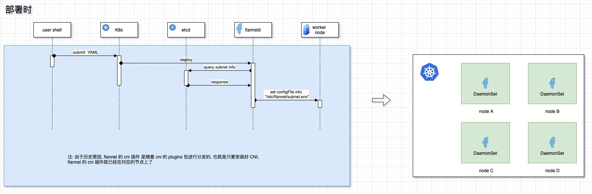

{"title": "flannel","description": "flannel 详解","category": "cloudnative","tag": ["docker","cloudnative","network"],"page_image": "/assets/flannel-00-header.png"}

# flannel

[TOC]

## 背景 和 flannel 要解决的问题

从 flannel 的角度看, Kubernetes 只提供了 CNI 接口, 而 flannel 要完成下层网络的连通和构建.

flannel 要解决基于 CNI 的问题包括如下: 

1. 分配每个 Pods 的网络地址 (知道每个 Pods 在哪)
2. 设置虚拟网络设备, 来负责虚拟网络连通 (让数据包到达 指定 Pods 的位置)

除此之外, 它还要解决 Kubernetes 环境下对 网络方案的要求: 

1. 所有的 Pods 都需要有 独立的 IP 地址
2. 所有的 Pods 都需要可以对外发包并接收到响应
3. 合理划分子网, 避免 ARP 泛洪问题.
4. 可以动态的分配 IP 地址, 而不是静态的地址分配
5. 节点上的 Pod 可以不通过 NAT 和其他任何节点上的 Pod 通信
6. 节点上的代理（比如：系统守护进程、kubelet）可以和节点上的所有Pod通信

基于这些问题, flannel 提出了如下被后面出现的网络方案视为标准的 point: 

1. 讲 Pod 的 CIDR 网段与 机器绑定, 从而避免不必要的数据包转发
   
1. ....// TOOD

明确了要解决的问题后, 需要来写一些代码来解决这些问题, flannel 选择了构建 overlay 网络的方式来解决 Kubernetes 网络的搭建问题.

## runtime 方案设计

flannel 几乎是最早的跨节点容器解决方案，flannel 提供很多种的网络模式，除了等下要详细讲的 `UDP` \ `VXLAN` \ `Host-Gateway` 这三个模式外，还包括如下

* 平台绑定的网络模式 ： `AliVPC` \ `AWSVPC` \ `TencentVPC` \ `GCE Route`
* `IPIP` \ `IPSec` 
* 仅限单机的 `Alloc`

### TUN ( backend UDP )

> 在其他大部分文章里, 以及 flannel 的官方文档里, 都会把这一阶段称为 `UDP` ,但笔者认为这个描述有失准确性, 这里的关键事实上不是 UDP, VXLAN 也是使用 UDP 来进行数据包的四层封装, 笔者认为这个方案的核心在于 TUN 设备. 遂这一节的标题笔者将它取为 TUN 

#### 设计

构建 overlay 网络, 最简单的方式自然是使用 TUN 来将 三层网络(L3) 的包抓上来, 然后由 应用层(L7) 重新封包 再投递. flannel 也是这么想的. 如下面的示意图所示, 


每个节点上会有一个 flannel 的 agent 叫做 `flanneld` , (下一章节会专门聊这个是如何预先配置到各个节点上的, 这里先专注在 Runtime 上) , 这个 Agent 会设置 router 和 开启 一个 tun 类型的网络设备 叫 `flannel 0` .

网络包从 `Network Namespace` 中, 透过 `veth pair` 来到 `docker0 (bridge)` 之后, 数据包的 `目标 mac 地址` 已经到达 (mac 地址是一段一段改变的), 当前数据包结构如下

```
# current package format

---------------
mac(L2)
---------------
ip (L3)
---------------
L4 protocal format
---------------
```

所以 bridge 会将这个数据包交给 `Linux 协议栈` 来做 L3 层的路由, `Linux 协议栈` 发现 数据包中的 `目标地址 IP` 符合 `Linux Kernel FIB` 中的路由规则, 接着会将 数据包 转发给 `flannel 0 设备`, 而 `flannel 0` 是 tun 设备, 在 收到 数据包后 会以 `L3 数据包` 的格式将 数据包 发给 flanneld 程序. 当前数据包结构如下

```
# current package format

---------------
ip (L3)
---------------
L4 protocal format
---------------
```

flanneld 程序会读取 收到的数据包 的 `目标 IP`, 根据 etcd 中的各 flannel 节点的 `网段信息` 判断 这个数据包要发给哪一个其他的 flanneld 程序. 

etcd 中的一个网段信息对应一个节点, 每个节点上会有一个 flanneld 程序, 而 etcd 中实际存储的就是一个网段信息对应一个 flanneld 程序的 IP 地址.

所以 flanneld 程序根据 etcd 中的 `网段信息` 知道了 数据包 的接受者在哪个节点之后,  就会将 数据包使用 UDP 的格式重新封包, 然后发送给对应节点的 flanneld 所监听的端口上. 当前数据包结构如下

```
# current package format

---------------
UDP (L4)
---------------
ip (L3)
---------------
L4 protocal format
---------------
```


接着数据包流经 当前节点的  eth0 网卡发送出去,  当前数据包结构如下

```
# current package format

---------------
Mac (L2)
---------------
other flanneld ip (L3)
---------------
UDP (L4)
---------------
ip (L3)
---------------
L4 protocal format
---------------
```

接着对端的 eth0 网卡接受到数据后, 开始将数据包解包, 在 L4 层发现是 Node B 上的 flanneld 监听的端口, 然后将 数据包透过 socket 的形式传输给 flanneld, 接着 flanneld 收到 eth0 给过来的数据包后,  当前数据包结构如下

```
# current package format

---------------
ip (L3)
---------------
L4 protocal format
---------------
```

将数据包再给回 flannel 0 这个 TUN 设备, TUN 设备会把这个包放回 L3 的协议栈中, 协议栈会去根据 Linux Kernel FIB 中的命中规则, 将 数据包发送 给 docker 0 , 然后 docker 0 完成 ip 到 mac 地址的转换, 将 数据包从对应的 veth pair 传输到 `network namespace` 中, 接着在 Linux 的协议栈 L4 拆包时, 将数据包给到 Biz App.  当前数据包结构如下

```
# current package format

---------------
L4 protocal format
---------------
```


这样就是 flannel 在 TUN 模式下, 数据包传输的全过程, 可以看到使用一个较为简单的结构, 以 overlay 的形式, 解决了 Kubernetes 网络的搭建.

#### 结

虽然 flannel 的 TUN 方案存在一些不小的缺陷(性能方面), 但可以看得出这个方案的潜力, 

* 通过以 节点维度 的网段划分, 来避免了要精确找到每个 IP 对应的 容器在哪的 问题 ~~(拯救大兵瑞恩 :))~~, 我们只需要知道这个节点对应的网段, 就可以知道这个数据包要发到哪个 flannel agent 上, 剩下的由 对应节点内部自行确定 数据包的接收容器. 虽然这个不一定是 flannel 首创, 可能在 传统的 VM 的网络方案中 就已经有. 但这是一个很棒的解决方案.

不过这个模式依旧存在缺陷, 主要是性能方面, 由于大量使用了 TUN 网络设备, 每发送一个数据包每次都会经历两次从 `用户态` 到 `内核态` 的切换,

```
  TUN ========> flanneld =======> eth 0
 内核态           用户态             内核态
```

这会造成不小的性能损耗, 接着尝试对这块做优化.

### backend VXLAN

可以看到 基于 TUN 的方案其实已经解决问题了(~~又不是不能用 :)~~), 接着需要去优化性能以适配对性能更加敏感的场景. TUN 模式下的问题在于 在用户态下, 对 数据包重新封装, 从而带来的性能问题. 那么是否有可能将这个重新封装的工作在 内核态 下完成呢? 这里 flannel 选择使用 Kernel 中的 VXLAN , 来代替刚刚 TUN 模式 的实现.在现在, VXLAN 已经变成了一个模式架构的代名词, 例如你可以使用 OVS(open vSwitch) 来实现一个 VXLAN , 但我们这里讨论的是 Linux Kernel 中的 VXLAN 实现.

#### 设计

VXLAN 透过和上述 TUN 模式类似的结构实现了一个 Overlay 网络, 它会在每个节点上有一个叫做 VTEP (VXLAN Tunnel Endpoint) 的 agent , 这个 agent 运行在内核态下. VXLAN 有组播模式, 以及 VNI 的概念, 


而读者从上面的描述里也看得到, flannel 仅仅只是想透过 VXLAN 性能而已, 并不是希望透过 VXLAN 来提供新的 feature , 所以 flannel 这里只是最简单的使用了 VXLAN, 比如 VNI 默认为 `1`, VTEP 不分组, 所有的 VTEP 都是一个组, 并且 flannel 会手动维护 VTEP 的 FDB(mac to ip) 表 和 ARP (ip to mac)表. 


在前面的流程都类似, 从 `Network Namespace` 出来, 经过 docker 0 / CNI 0 , 然后来到 `Linux Kernel FIB`, 匹配到路由规则, 将数据包丢给 flannel.1 , 在这里 透过 flanneld 以及 flanneld 维护的 FDB 以及 ARP 表, 按照 VXLAN 的方式包装后, 将数据包丢给 Node B, 接着 Node B 里的 VTEP 进行解包, 然后将数据透过 Linux Kernel Router 中的路由给到 docker0 / cni0 bridge , 接着再通过 veth pair 给到 实际的应用程序.

#### 结

看起来这里的转发链条短了一些, 并且转发效率比 TUN 方案好一些,整个过程完全在内核态完成, flanneld 并不直接参与转发过程, 只是负责进行配置. 

但是由于  VXLAN 本身就有一定的复杂性, 让它的加入使得 flannel 的复杂度又稍有上升. flannel 在 FDB 和 ARP 表的维护问题上改进了两次方案, 起初是让 VTEP 自动学习, 最后干脆直接让 flanneld 自行手动维护. 

### backend Host-Gateway

#### 设计

其实本质上, 也就只是想把 数据包 转发到对应的节点上, 然后让那个节点自行将 数据包 投递到对应的容器中, 那么我们能不能让对应的节点作为网关呢? 


flannel 就是这么做的, flanneld 会配置 路由规则在 `Linux Kernel FIB` 上, 但是这次它会把 Node B 对应的路由网关设置为 Node B的 IP, 并创建另一个网卡 eth1, 并且在 eth 1 的网段设置上, 故意和原有的 eth0 错开网段, 当 Node A 的 `Linux Kernel FIB` 想直接转发数据包给 Node B 的时候, 发现这是另一个网段的包, 它尚未知道 Node B 的 Mac 地址, 所以 Node A 会将数据包传给 对应的 网关, 数据包就直接给到 Node B, 这个时候 Node B 只需要将数据包投递给对应的容器即可, 可以看到方案的变得简单了很多.

Node A 的路由表大致长这样子

```
10.244.0.0		0.0.0.0		        255.255.255.0 u 0 0 0 cni0
10.244.1.0		172.16.139.150		255.255.255.0 u 0 0 0 eth1
10.244.2.0		172.16.139.154		255.255.255.0 u 0 0 0 eth1
```

在 host-gateway 模式后, flanneld 的作用就只有刷新每个节点上的 路由表了.

#### 结

由于 Host-Gateway 会指定对应的节点 IP 作为网关, 那么它就要求所有的节点必须在一个子网范围内, 不然脱离了当前的子网, 则需要另行配置上层网络的路由规则, 但 flannel 无法控制上层网络, 这将使 flannel 变得复杂, 所以 Host-Gateway 方案只支持在同一个子网内, 不过这个条件在 K8s 上, 集群规模不大的话, 还是很容易达成的. 

### runtime 方案设计 \[结\]

从笔者的角度在总结的话, TUN 方案笔者认为更像一个完成需求的 MVP(最小可行性模型), 虽然能够完成需求, 但是有一定的缺陷, 我觉得 CoreOS 的工程师一定知道在用户态下处理网络包会出现性能问题, 即便如此, 他们还是这么做了, flannel 是一个很早就出现的 K8s 网络方案, 可以看出他们的探索模式还是挺值得学习的.

接着再对这个 MVP 优化, 借助 VXLAN 的力量, 将整个业务流程完全拉到内核态下, 就避免了用户态和 内核态切换的性能耗损, 但也无可避免需要消化 VXLAN 的复杂性. 你可以看到 flannel 只使用了 VXLAN 很小的一部分功能, VNI 直接永远设为 1 , FDB 和 ARP 都是手动维护的.

随后, 可能是有了灵感, 直接将 对应的节点作为 网关, 这样就解决了转发的复杂性, 并且由于是直接路由转发的方案, 性能也是有保证的.

再随后, flannel 还做了 例如 `ipip转发`(host-gw 的再改进版), `ipsec` 等的方案, 这些方案的思路和上述方案的思路类似, 这里就不赘述. 

## 与 K8s 结合

大多数的文章写到这里就停了, 但其实只介绍 flannel 的  runtime 是没有办法和 K8s 相关知识串起来的, 还需要了解 flannel 是如何 支持 CNI 来达成和 K8s 协作的.

首先, flannel 本身和 CNI 是无关的, flannel 会有 一个 cni-plugins 专门与 cni 交互. 我们透过 K8s 拉取的 flannel 镜像, 首先会有一个 Init Container 将CNI 的 配置信息 copy 到本机的对应的位置. 会运行 flanneld, 然后在 /etc/flannel/subnet.env 中写入当前机器分配到的子网信息, 接着 flanneld 根据所设置的 flannel 模式, 会进行自己的工作. 



接着, 在创建容器的时候, CRI 的实现, 例如 containerd , 会调用 CNI 的接口, 要求 CNI 去生成一份 容器的网络信息, 这时 CNI 读取本机的 CNI 配置, 去通过 Shell 命令执行 CNI 中写的 CNI plugins, 这个时候会启动 flannel 的 cni plugins, 这个程序会根据读取 flannel 写在 `/etc/flannel/subnet.env` 的子网信息, 然后读取 CNI 的配置信息, 接着还是调用 CNI 的库, 将这些配置信息传给 CNI 方法, 接着 CNI 的方法会调用配置的工具进行 `bridge`, `veth pair` 等网络设备的创建, 然后调用注册的 IPAM 程序分配 IP 地址 (默认是 `host-local` ), 在一切就绪后, 会将 IP地址等信息通过标准输出给回 CRI 中调用的 CNI 的方法, 然后 CNI 的 function 序列化数据后, 将数据返回给 CRI 插件. 时序图如下: 


你可以看到 flannel 并不是强绑定 K8s 的, flannel 只是依赖 etcd . 大多数的 K8s 的网络方案自身也支持 为虚拟机提供服务.  

## ref

* [CNI - Flannel - IP 管理篇 - hwchiu](https://www.hwchiu.com/cni-flannel-ii.html)
* [CNI -jimmysong](https://jimmysong.io/kubernetes-handbook/concepts/cni.html)
