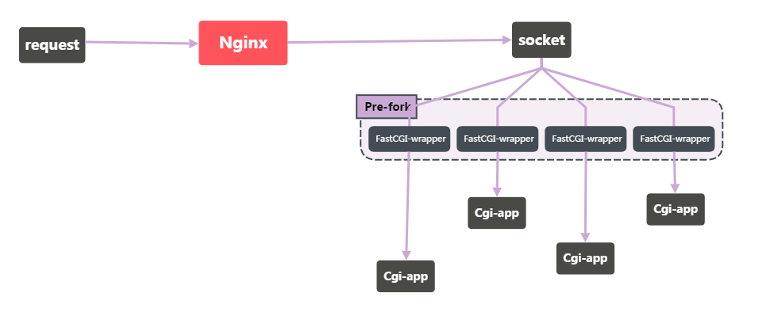

# Nginx to PHP-FPM

[Nginx](https://zh.wikipedia.org/wiki/Nginx) 是最早由 俄国人 `Igor Sysoev` 开发的 `Webserver`。我们通常会对 PHP-FPM ， FastCGI 比较熟悉，但是对于 Nginx 、PHP 这对老搭档具体的交互细节并不清楚。

---
我们现在配置了一个这样的环境

* **PHP 7.1.x**
* **Nginx 1.12.x**

Nginx 配置如下：

```nginx
server
    {
        listen 80 default_server;
        index index.php;
        root /home/work/imooc;

        location ~ [^/]\.php(/|$)
        {
            ###########################################
            fastcgi_pass unix:/tmp/php-cgi.sock;     ##← ← ← ← ← ← 注意这一块  
            fastcgi_index index.php;                 ##← ← ← ← ← ← 注意这一块
            include fastcgi.conf;                    ##← ← ← ← ← ← 注意这一块
            ###########################################
        }
        access_log /home/work/logs/imooc.log;

}
```

从上面的 Nginx 配置中可以注意到 `fastcgi*` 开头的一些配置，以及引入的 `fastcgi.conf` 文件。其实在 `fastcgi.conf` 中，也是一堆 `fastcgi*` 的配置项，只是这些配置项相对不常变，通常单独文件保管可以在多处引用。下面是 `fastcgi.conf` 的内容

```nginx
# Nginx 1.12.2
fastcgi_param  QUERY_STRING       $query_string;
fastcgi_param  REQUEST_METHOD     $request_method;
fastcgi_param  CONTENT_TYPE       $content_type;
fastcgi_param  CONTENT_LENGTH     $content_length;

fastcgi_param  SCRIPT_NAME        $fastcgi_script_name;
fastcgi_param  REQUEST_URI        $request_uri;
fastcgi_param  DOCUMENT_URI       $document_uri;
fastcgi_param  DOCUMENT_ROOT      $document_root;
fastcgi_param  SERVER_PROTOCOL    $server_protocol;
fastcgi_param  REQUEST_SCHEME     $scheme;
fastcgi_param  HTTPS              $https if_not_empty;

fastcgi_param  GATEWAY_INTERFACE  CGI/1.1;
fastcgi_param  SERVER_SOFTWARE    nginx/$nginx_version;

fastcgi_param  REMOTE_ADDR        $remote_addr;
fastcgi_param  REMOTE_PORT        $remote_port;
fastcgi_param  SERVER_ADDR        $server_addr;
fastcgi_param  SERVER_PORT        $server_port;
fastcgi_param  SERVER_NAME        $server_name;

# PHP only, required if PHP was built with --enable-force-cgi-redirect
fastcgi_param  REDIRECT_STATUS    200;

```

可以看到在 `fastcgi.conf` 中，有很多的 `fastcgi_param` 配置，结合 `nginx server` 配置中的 `fastcgi_pass` 、 `fastcgi_index` ，已经能够想到 `Nginx` 与 `PHP` 之间打交道就是用的 `FastCGI` ，接着让我们探究更加深入的问题。

`CGI` 是 `通用网关协议`，`FastCGI` 则是一种常驻进程的 `CGI` 模式程序。我们所熟知的 `PHP-FPM` 的全称是 `PHP FastCGI Process Manager` ，即 `PHP-FPM` 会通过用户配置来管理一批 `FastCGI` 进程，例如在 `PHP-FPM` 管理下的 `某个FastCGI` 进程挂了，`PHP-FPM` 会根据用户配置来看是否要重启补全，`PHP-FPM` 更像是管理器，而真正衔接 `Nginx` 与 `PHP` 的则是 `FastCGI` 进程。




`updating`


> 文章源 来自: https://www.imooc.com/article/19278  
> 在此基础上有做 修改 和 编辑

> 转载 注明出处
